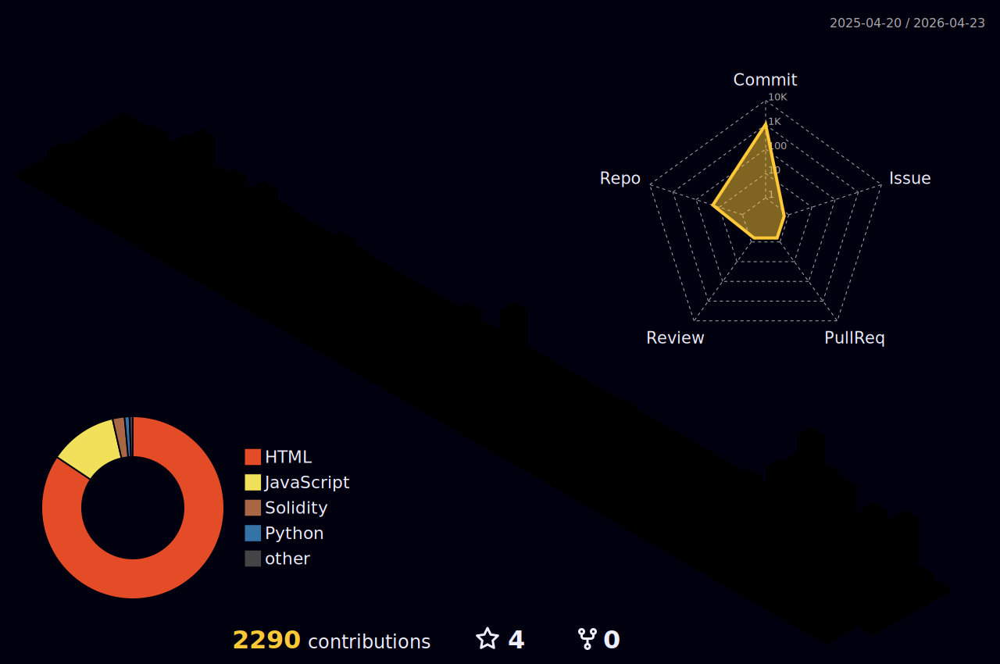

 

&nbsp;

&nbsp;

&nbsp;

&nbsp;

&nbsp;

&nbsp;

&nbsp;

&nbsp;

---

I build systems — precision mechanical, financial, spiritual, and technological — engineered to honor human dignity, protect personal sovereignty, and create pathways to freedom.

For nearly two decades I've worked in precision manufacturing. Today I apply that same discipline to spiritual-technological systems: decentralized governance, gratitude-based tokens, AI-assisted trading, and tools that empower people navigating hard transitions.

**Currently building:**
- 🌈 **[Ethereal Offering](https://drasticstatic.github.io/gratitude-token-project_docs/)** — gratitude-based DAO with soulbound DIDs, ritual intelligence, and ZK governance
- 📊 **[Trading Systems](https://drasticstatic.github.io/trading-assistant-public-preview/)** — MNQ/RTY futures with AI-assisted analysis across Apex & TPT prop firms
- 🤖 **AI Agent Workflows** — Claude Code + MCP servers spanning trading, legal research, and Web3
- ⚖️ **Private Tools** — sovereignty-first software for people navigating hard life transitions
- 🌐 **Public Surfaces** — open HTML templates, code snippets, and workflow tooling so others can learn from and build on them

---

<!-- Generated nightly by github-profile-3d-contrib workflow -->

---

**Languages**

**Frontend & Frameworks**

**Web3 & Blockchain**

**Backend & DevOps**

**AI & Automation**

![OpenAI](https://img.shields.io/badge/OpenAI-74aa9c?style=flat&logo=data:image/svg%2Bxml;base64,PHN2ZyB4bWxucz0iaHR0cDovL3d3dy53My5vcmcvMjAwMC9zdmciIHZpZXdCb3g9IjAgMCAyNCAyNCIgZmlsbD0id2hpdGUiPjxwYXRoIGQ9Ik0yMi4yOCA5LjgyYTUuOTggNS45OCAwIDAgMC0uNTItNC45MSA2LjA1IDYuMDUgMCAwIDAtNi41MS0yLjkgNS45OCA1Ljk4IDAgMCAwLTQuNTEtMi4wMSA2LjA1IDYuMDUgMCAwIDAtNS43NyA0LjE5IDUuOTggNS45OCAwIDAgMC0zLjk5IDIuOSA2LjA1IDYuMDUgMCAwIDAgLjc0IDcuMDkgNS45OCA1Ljk4IDAgMCAwIC41MSA0LjkxIDYuMDUgNi4wNSAwIDAgMCA2LjUxIDIuOUE1Ljk4IDUuOTggMCAwIDAgMTMuMjUgMjRhNi4wNSA2LjA1IDAgMCAwIDUuNzctNC4xOSA1Ljk4IDUuOTggMCAwIDAgMy45OS0yLjkgNi4wNSA2LjA1IDAgMCAwLS43My03LjA3ek0xMy4yNSAyMi41YTQuNDggNC40OCAwIDAgMS0yLjg4LTEuMDRsLjE0LS4wOCA0Ljc4LTIuNzZhLjc5Ljc5IDAgMCAwIC40LS42OFYxMS43bDIuMDIgMS4xN2EuMDcuMDcgMCAwIDEgLjA0LjA1djUuNThhNC41IDQuNSAwIDAgMS00LjUgNC41em0tOS42Ni00LjEzYTQuNDcgNC40NyAwIDAgMS0uNTMtMy4wMWwuMTQuMDggNC43OCAyLjc2YS43Ny43NyAwIDAgMCAuNzggMGw1Ljg0LTMuMzd2Mi4zM2EuMDguMDggMCAwIDEtLjAzLjA2bC00Ljg0IDIuNzlhNC41IDQuNSAwIDAgMS02LjE0LTEuNjR6TTIuMzQgNy45YTQuNDkgNC40OSAwIDAgMSAyLjM3LTEuOTd2NS42M2EuNzcuNzcgMCAwIDAgLjM5LjY4bDUuODEgMy4zNS0yLjAyIDEuMTdhLjA4LjA4IDAgMCAxLS4wNyAwTDMuOTUgMTMuOTdBNC41IDQuNSAwIDAgMSAyLjM0IDcuOXptMTYuNiAzLjg2bC01Ljg0LTMuMzcgMi4wMi0xLjE3YS4wOC4wOCAwIDAgMSAuMDcgMGw0LjgzIDIuNzlBNC41IDQuNSAwIDAgMSAxOS4zIDE4di01LjY4YS43OS43OSAwIDAgMC0uMzYtLjU2em0yLjAxLTMuMDJsLS4xNC0uMDgtNC43Ny0yLjc4YS43OC43OCAwIDAgMC0uNzkgMEw5LjQxIDkuMjNWNi45YS4wNy4wNyAwIDAgMSAuMDMtLjA2bDQuODMtMi43OWE0LjUgNC41IDAgMCAxIDYuNjggNC42NnpNOC4zMSAxMi44NmwtMi4wMi0xLjE2YS4wOC4wOCAwIDAgMS0uMDQtLjA2VjYuMDdhNC41IDQuNSAwIDAgMSA3LjM4LTMuNDVsLS4xNC4wOC00Ljc4IDIuNzZhLjc5Ljc5IDAgMCAwLS40LjY4em0xLjEtMi4zN2wyLjYtMS41IDIuNiAxLjV2M2wtMi42IDEuNS0yLjYtMS41eiIvPjwvc3ZnPg==)

**Dev Tools**

**Platforms, OS & Security**

**CNC & Precision Engineering**

---

